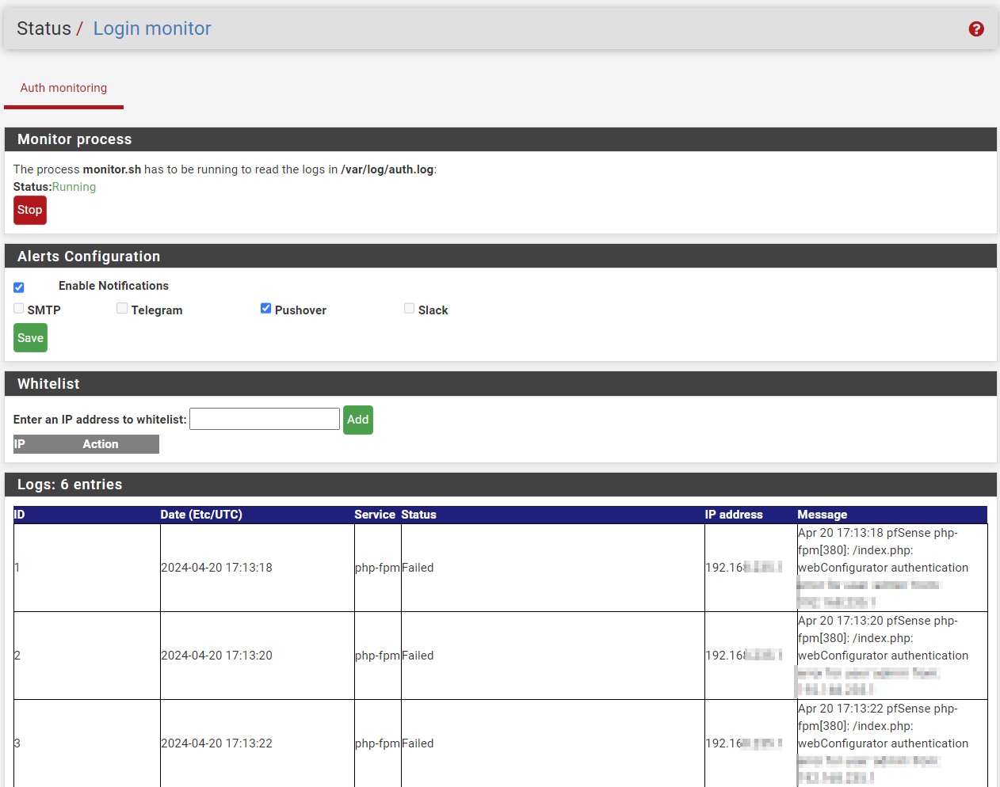

# pfs-paranoid
PFsense plugin to receive login alerts

## How does it work ? 

The **monitor.sh** script parses the log file `/var/log/auth.log` and sends it to **insert.php** for further processing and insertion into the local SQlite3 database. If the conditions are met and the entry is new, this script also sends the notification(s) by leveraging the functions implemented in the PFsense file `/etc/inc/notices.inc`. E.g:

- notify_via_slack($message)
- notify_via_pushover($message)
- notify_via_telegram($message)
- notify_via_smtp($message)

Those settings are defined beforehand by the administrator in: System -> Advanced -> Notifications

# Installation

**monitor.sh** has to be in /tmp/

`chmod +x /tmp/monitor.sh`

**paranoid.php**, **paranoid.inc** and **insert.php** goes in `/usr/local/www/packages/paranoid/`
## Interface

https://pfsense.local/packages/paranoid/paranoid.php

# Todo

Refactor the project to standardize it for pfSense and create a FreeBSD package.
